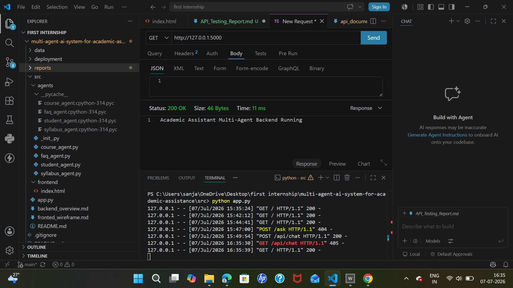
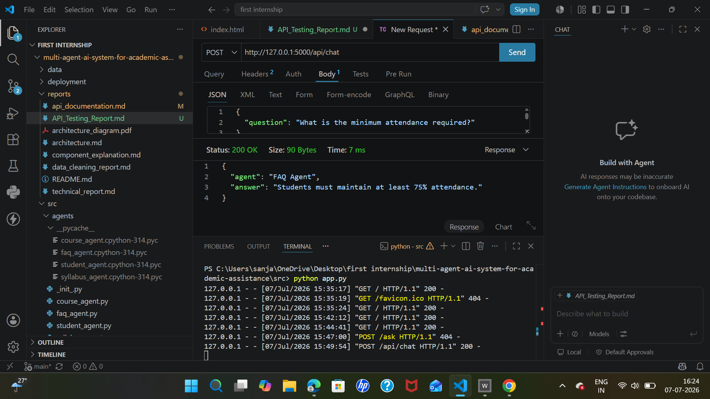

# API Testing Report

## Project
**Multi-Agent AI System for Academic Assistant**

---

## Objective

The objective of API testing is to verify that the backend APIs are working correctly, returning valid responses, and communicating successfully with the frontend application.

---

## Testing Tool

- Thunder Client (VS Code Extension)

---

## Test Environment

- Backend Framework: Flask
- Frontend: HTML, CSS, JavaScript
- Testing Tool: Thunder Client
- Local Server: http://127.0.0.1:5000

---

# Test Case 1

### API Endpoint
**GET /**

### Purpose
Check whether the backend server is running.

### Request

```
GET http://127.0.0.1:5000/
```

### Expected Result

Backend should return a successful status message.

### Actual Result

```
Academic Assistant Multi-Agent Backend Running
```

### Status

✅ PASS

---

# Test Case 2

### API Endpoint
**POST /api/chat**

### Purpose

Send an academic question to the AI system and receive an appropriate response.

### Request

```
POST http://127.0.0.1:5000/api/chat
```

### Request Body

```json
{
  "question": "What is the minimum attendance required?"
}
```

### Expected Result

The system should return a valid JSON response containing the answering agent and the correct answer.

### Actual Result

```json
{
  "agent": "FAQ Agent",
  "answer": "Students must maintain at least 75% attendance."
}
```

### Status

✅ PASS

---

## Testing Summary

| Test Case | Result |
|-----------|--------|
| Backend Status API (GET /) | ✅ PASS |
| Chat API (POST /api/chat) | ✅ PASS |

---

## Conclusion

The backend APIs were successfully tested using Thunder Client. The backend server is running correctly, and the chat API accepts academic questions and returns valid JSON responses. The communication between the frontend and backend is functioning successfully.

---

## Screenshots

1. Thunder Client GET request showing:
   - **Academic Assistant Multi-Agent Backend Running**
   

2. Thunder Client POST request showing:
   - Request Body
   - JSON Response from **FAQ Agent**
   